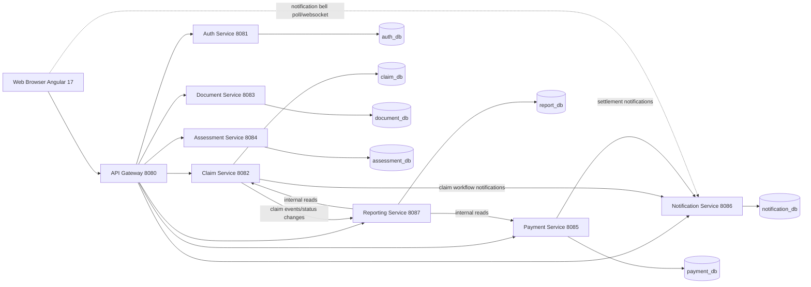
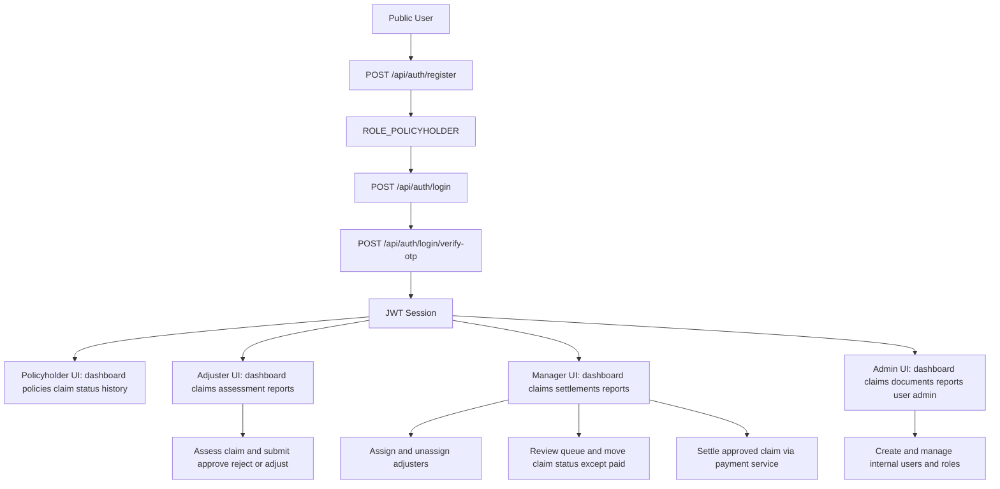
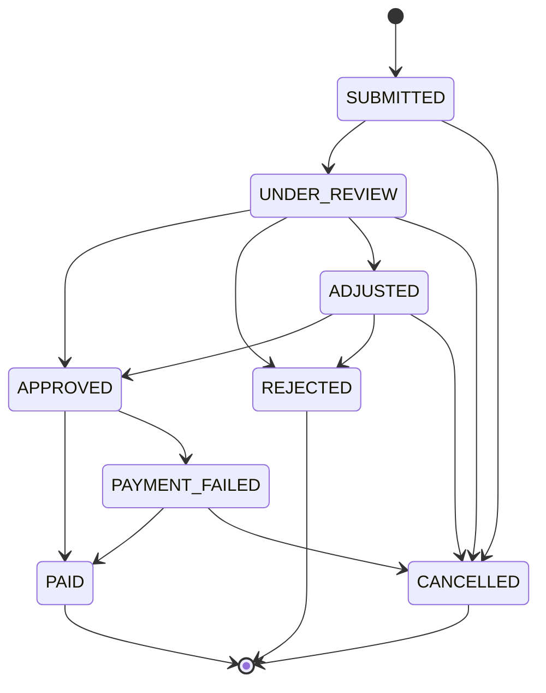

# ClaimSwift Workflow Diagram

Last updated: 2026-03-08

## End-to-End System Workflow

```mermaid
flowchart LR
    U[Web Browser Angular 17] --> G[API Gateway 8080]

    G --> A[Auth Service 8081]
    G --> C[Claim Service 8082]
    G --> D[Document Service 8083]
    G --> S[Assessment Service 8084]
    G --> P[Payment Service 8085]
    G --> N[Notification Service 8086]
    G --> R[Reporting Service 8087]

    A --> DBA[(auth_db)]
    C --> DBC[(claim_db)]
    D --> DBD[(document_db)]
    S --> DBS[(assessment_db)]
    P --> DBP[(payment_db)]
    N --> DBN[(notification_db)]
    R --> DBR[(report_db)]

    C -- claim events/status changes --> R
    R -- internal reads --> C
    R -- internal reads --> P

    C -- claim workflow notifications --> N
    P -- settlement notifications --> N
    U -. notification bell poll/websocket .-> N
```

## Role Workflow

```mermaid
flowchart TD
    A0[Public User] --> A1[POST /api/auth/register]
    A1 --> A2[ROLE_POLICYHOLDER]
    A2 --> A3[POST /api/auth/login]
    A3 --> A4[POST /api/auth/login/verify-otp]
    A4 --> A5[JWT Session]

    A5 --> P1[Policyholder UI: dashboard policies claim status history]
    A5 --> J1[Adjuster UI: dashboard claims assessment reports]
    A5 --> M1[Manager UI: dashboard claims settlements reports]
    A5 --> AD1[Admin UI: dashboard claims documents reports user admin]

    J1 --> J2[Assess claim and submit approve reject or adjust]
    M1 --> M2[Assign and unassign adjusters]
    M1 --> M3[Review queue and move claim status except paid]
    M1 --> M4[Settle approved claim via payment service]

    AD1 --> AD2[Create and manage internal users and roles]
```

## Claim Status Lifecycle

```mermaid
stateDiagram-v2
    [*] --> SUBMITTED
    SUBMITTED --> UNDER_REVIEW
    SUBMITTED --> CANCELLED

    UNDER_REVIEW --> APPROVED
    UNDER_REVIEW --> REJECTED
    UNDER_REVIEW --> ADJUSTED
    UNDER_REVIEW --> CANCELLED

    ADJUSTED --> APPROVED
    ADJUSTED --> REJECTED
    ADJUSTED --> CANCELLED

    APPROVED --> PAID
    APPROVED --> PAYMENT_FAILED

    PAYMENT_FAILED --> PAID
    PAYMENT_FAILED --> CANCELLED

    REJECTED --> [*]
    PAID --> [*]
    CANCELLED --> [*]
```
